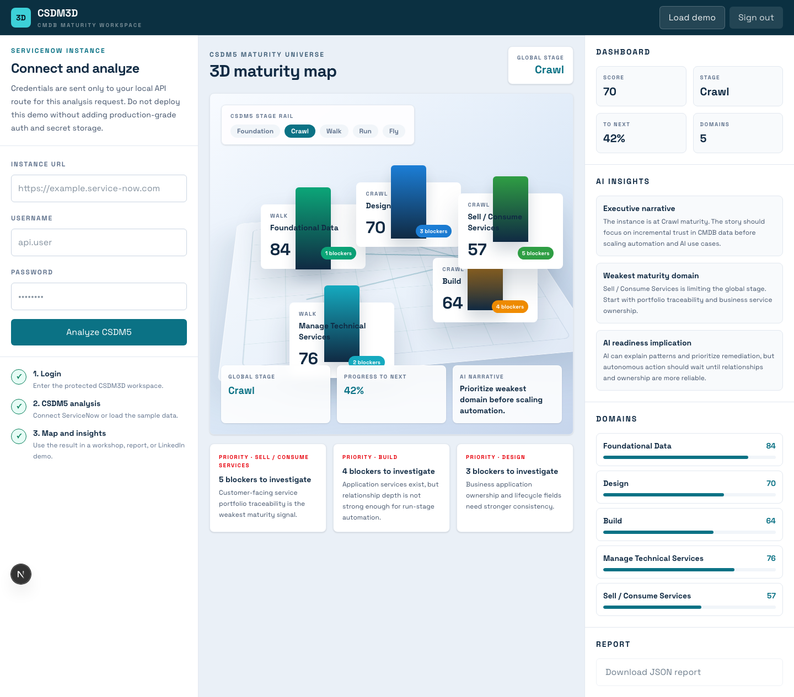

# CSDM3D

CSDM3D is a public ServiceNow CMDB/CSDM5 maturity demo application.

It helps architects, TAEs, consultants, and platform teams turn CSDM5 maturity into a visual conversation:

- Login-style protected workspace
- ServiceNow instance connection
- Lightweight CSDM5 domain analysis
- 3D-style maturity map
- AI-ready insights and dashboard
- JSON report export



Launch media:

- [Demo video MP4](public/csdm3d-assets/csdm3d-demo.mp4)
- [Login screenshot](public/csdm3d-assets/01-login.png)
- [Dashboard screenshot](public/csdm3d-assets/03-dashboard-insights.png)

## Positioning

CSDM3D does not replace ServiceNow CMDB, Discovery, Service Mapping, Now Assist, or governance workflows.

It complements the platform by making maturity easier to see, explain, and prioritize.

## Quick Start

```bash
npm install
npm run dev
```

Open `http://localhost:3000`.

Use the demo login values already filled in, then click `Load demo`.

## Live ServiceNow Analysis

The live analysis form calls:

```text
POST /api/servicenow/analyze
```

It uses the ServiceNow Table API to check lightweight table availability and record-count signals across CSDM5 domains.

This public build intentionally does not persist ServiceNow credentials. For a production deployment, add:

- real authentication
- encrypted credential storage
- rate limiting
- audit logging
- stricter ServiceNow role guidance
- customer data retention policy

## Launch Assets

LinkedIn copy, launch hooks, and the video storyboard are in [`docs/`](docs/).

Final screenshots and videos should be regenerated from the app before launch so the public post matches the shipped UI.

## CSDM5 Domains

- Foundational Data
- Design
- Build
- Manage Technical Services
- Sell / Consume Services

## Personal Brand Narrative

This project is meant to be shared as a community accelerator:

> I wanted to make CSDM maturity visible, explainable, and easier to act on.

AI is used as an interpretation layer:

- explain the pattern
- identify weak domains
- prioritize next steps
- translate technical maturity into executive language

## License

MIT
